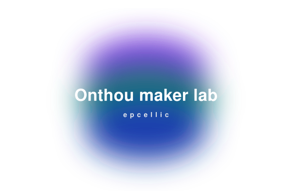

  <a href="./README_CN.md">简体中文</a> ·
  <a href="./README.md">English</a>

<!-- BLOCK: 01-banner ------------------------------------------------------ -->

<!-- 横向椭圆胶囊：紫→青绿→深蓝 自上而下渐变 -->

  

<!-- /BLOCK -->

<!-- BLOCK: 02-typing ------------------------------------------------------ -->

<!-- 打字机副标题：3 条定位轮播 -->

  

<!-- /BLOCK -->

<!-- BLOCK: 03-meta-badges ------------------------------------------------- -->

<!-- 联系方式 / 身份徽章行：邮箱 / 个人网站 / 地区（参考 README参考2.md 的 
 写法） -->

  
  
  

<!-- /BLOCK -->

<!-- BLOCK: 04-headline ---------------------------------------------------- -->

<!-- 主标题 + 2~3 句自我介绍 -->

<h2 align="center">about epcellic</h2>

  这是我个人的开源账号，主要分享一些我在工作中制作的快捷工具，以及我在学习和比赛过程中产出的软硬件内容与作品。我的作品大多融合了实用功能与艺术视觉设计；同时我也会进行一些媒体活动，欢迎联系我。

<!-- /BLOCK -->

<!-- BLOCK: 05-focus-areas ------------------------------------------------- -->

<!-- 方向 / 能力矩阵：表格形式，4 行 -->

## 专注方向

| 方向               | 我在做什么                                                         |
| :----------------- | :----------------------------------------------------------------- |
| **硬件设计** | 负责机械、单片机、嵌入式及上位机软件开发的全流程硬件产品设计工作。 |
| **软件开发** | AI 智能体搭建、网页前后端开发、服务器搭建、任务自动化。            |
| **个人媒体** | 个人工作室 Dreamlet Studio，主要做科普和知识分享。                 |
| **射频微波** | 学生科研工作，主要用于高频无线充电领域。                           |

<!-- /BLOCK -->

<!-- BLOCK: 06-now --------------------------------------------------------- -->

<!-- 当前正在做的事 -->

## 近期在做

- 商业 Visio 插件开发
- WPT 前沿研究学习

<!-- /BLOCK -->

<!-- BLOCK: 08-stack ------------------------------------------------------- -->

<!-- 技术栈：按属性分类的 shields.io 小标签 -->

## 技术栈

| 属性                      | 数据                                                                                                                                                                                                                                                                                                                                                                                                                                                                                                                                                                                                                                                                                                                                                                                                    |
| :------------------------ | :------------------------------------------------------------------------------------------------------------------------------------------------------------------------------------------------------------------------------------------------------------------------------------------------------------------------------------------------------------------------------------------------------------------------------------------------------------------------------------------------------------------------------------------------------------------------------------------------------------------------------------------------------------------------------------------------------------------------------------------------------------------------------------------------------ |
| **语言**            |                                                                                                                                                                                                                                                                                                                                                                                                                                                                                                                                                                                                                  |
| **IDE / 编辑器**    |                                                                                                                                                                                                                                                                                                                                                                                                                                                  |
| **嵌入式 / 单片机** |         |
| **机器人 / 中间件** |                                                                                                                                                                                                                                                                                                                                                                                                                                                                                                                                                                                                                                                                                                             |
| **射频 / 仿真**     |                                                                                                                                                                                                                                                                                                                                                                                                                                                                                                                                    |
| **EDA / PCB**       |                                                                                                                                                                                                                                                                                                                                                                                                                                                                                                                                                                          |
| **机械 / 3D 设计**  |                                                                                                                                                                                                                                                                                                                                                       |
| **前端 / Web**      |                                                                                                                                                                                                                                                                                                                                                                                                                                                                                                                                                                                                      |
| **操作系统 / 平台** |                                                                                                                                                                                                                                                                                                                                                                                                                                                                                                                                                                                                      |
| **版本控制 / 协作** |                                                                                                                                                                                                                                                                                                                                                                                                                                                                                                                                                                                                            |
| **设计 / 媒体**     |                                                                                                                                                                                                                                                                                                    |

<!-- /BLOCK -->

<!-- BLOCK: 09-ai-tools ---------------------------------------------------- -->

<!-- AI 工具：按场景分类的 shields.io 小标签 -->

## AI 工具

| 属性                    | 数据                                                                                                                                                                                                                                                                                                                                                                                                                                                   |
| :---------------------- | :----------------------------------------------------------------------------------------------------------------------------------------------------------------------------------------------------------------------------------------------------------------------------------------------------------------------------------------------------------------------------------------------------------------------------------------------------- |
| **代码 / IDE**    |       |
| **对话 / 大模型** |                                                                                                |
| **视觉 / 生成**   |                                                                                                                                                                                                                                                                    |
| **音频 / 语音**   |                                                                                                                                                                                      |

<!-- /BLOCK -->

<!-- BLOCK: 12-github-activity --------------------------------------------- -->

<!-- GitHub 动态组件：统计卡 + 贪吃蛇（由 .github/workflows/snake.yml 自动生成 SVG） -->

## GitHub 动态

  <picture>
    <source media="(prefers-color-scheme: dark)" srcset="https://raw.githubusercontent.com/epcellic/epcellic/output/github-contribution-grid-snake-dark.svg" />
    <source media="(prefers-color-scheme: light)" srcset="https://raw.githubusercontent.com/epcellic/epcellic/output/github-contribution-grid-snake.svg" />
    
  </picture>

<!-- /BLOCK -->

<!-- BLOCK: 13-contact ----------------------------------------------------- -->

<!-- 结尾 CTA：邮箱 + 个人网站按钮 + 一句签名式结语 -->

## 一起做点什么

欢迎继续开发我的项目——比如 MAVLink 项目。

  
  

<!-- /BLOCK -->
